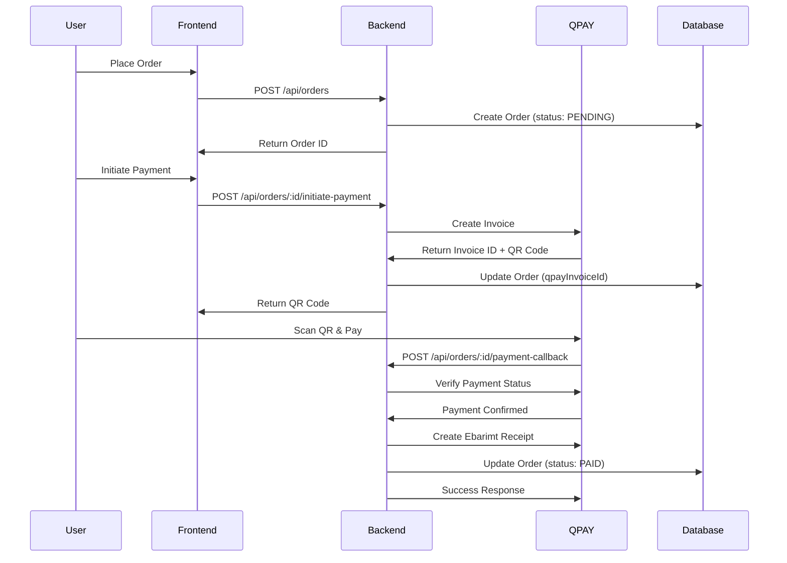

# QPAY Payment Integration Documentation

## Overview

This document describes the QPAY V2 payment system integration for the ecommerce platform. QPAY is a Mongolian payment gateway that supports dynamic QR code payments (CPM/MPM) that can be scanned by bank apps and wallet applications.

## Features

- **Token-based Authentication** - Secure API authentication with timestamp-based token caching
- **Invoice Creation** - Detailed invoice creation with tax lines, discounts, and surcharges
- **QR Code Expiry** - QR codes automatically expire after 1 hour for security
- **Payment Verification** - Automatic payment status checking and order confirmation
- **Callback Handling** - Secure webhook endpoint for payment notifications
- **Ebarimt Integration** - Automatic receipt generation (Ebarimt 3.0)
- **Payment Management** - Cancel unpaid invoices and refund completed payments
- **Error Handling** - Comprehensive error handling with retry mechanisms

## Architecture

The QPAY integration follows the existing service-controller-route pattern:

```
QPAY Service → Payment Controller → Payment Routes → Order Integration
```

### Components

1. **QPAY Service** (`src/services/qpayService.js`)
   - Handles all QPAY API interactions
   - Manages token caching (critical: one token per timestamp)
   - Implements retry logic with exponential backoff

2. **Payment Controller** (`src/controllers/paymentController.js`)
   - Handles payment-related HTTP requests
   - Processes QPAY callbacks
   - Manages payment status updates

3. **Payment Routes** (`src/routes/paymentRoutes.js`)
   - Defines payment API endpoints
   - Configures authentication middleware

## Setup

### 1. Environment Variables

Add the following environment variables to your `.env` file:

```env
# QPAY Payment Configuration
QPAY_API_URL=https://merchant.qpay.mn/v2
QPAY_USERNAME=YOUR_QPAY_USERNAME
QPAY_PASSWORD=YOUR_QPAY_PASSWORD
QPAY_INVOICE_CODE=YOUR_INVOICE_CODE
QPAY_CALLBACK_BASE_URL=https://api.gerar.mn/api
```

**Important Notes:**
- `QPAY_USERNAME` and `QPAY_PASSWORD` are your QPAY merchant credentials
- `QPAY_INVOICE_CODE` is provided by QPAY (e.g., `GERAR_INVOICE`)
- `QPAY_CALLBACK_BASE_URL` should be your production API base URL
- For local development, use `http://localhost:3000/api` or your ngrok URL

### 2. Database Migration

The payment fields have been added to the `order` model. If you haven't run migrations yet:

```bash
npx prisma migrate deploy
npx prisma generate
```

### 3. Verify Installation

Ensure `axios` is installed (should already be in dependencies):

```bash
npm list axios
```

## API Endpoints

### 1. Initiate Payment

Create a QPAY invoice for an order.

**Endpoint:** `POST /api/orders/:id/initiate-payment`

**Authentication:** Required (user or admin)

**Request:**
```bash
POST /api/orders/123/initiate-payment
Authorization: Bearer <token>
```

**Response:** `201 Created`
```json
{
  "success": true,
  "message": "Payment invoice created successfully",
  "data": {
    "orderId": 123,
    "qpayInvoiceId": "f68db12b-260f-427f-afa2-c83064aee76a",
    "qrCode": "data:image/png;base64,...",
    "qrText": "https://qpay.mn/invoice/...",
    "urls": {
      "web": "https://qpay.mn/invoice/...",
      "deeplink": "qpay://invoice/..."
    },
    "paymentStatus": "PENDING",
    "amount": 20000.00,
    "expiryDate": "2026-01-26T15:30:00.000Z",
    "isExpired": false
  }
}
```

**Note:** The QR code expires 1 hour after creation. The `expiryDate` field contains the ISO 8601 timestamp when the QR code will expire, and `isExpired` indicates if it's already expired.

**Error Responses:**
- `400` - Order already paid or cancelled
- `404` - Order not found
- `401` - Authentication required

### 2. Payment Callback (Webhook)

QPAY calls this endpoint when payment is received. **This endpoint is PUBLIC** (no authentication required).

**Endpoint:** `POST /api/orders/:id/payment-callback`

**Authentication:** None (public endpoint)

**Request:** (Called by QPAY)
```bash
POST /api/orders/123/payment-callback
Content-Type: application/json
```

**Response:** `200 OK`
```json
{
  "success": true,
  "message": "Payment confirmed"
}
```

**Note:** The callback handler:
1. Verifies payment with QPAY API
2. Updates order status to `PAID`
3. Generates Ebarimt receipt
4. Returns success to QPAY (even on errors, so QPAY can retry)

### 3. Get Payment Status

Check the payment status of an order.

**Endpoint:** `GET /api/orders/:id/payment-status`

**Authentication:** Required (user or admin)

**Request:**
```bash
GET /api/orders/123/payment-status
Authorization: Bearer <token>
```

**Response:** `200 OK`
```json
{
  "success": true,
  "data": {
    "orderId": 123,
    "paymentStatus": "PAID",
    "qpayInvoiceId": "f68db12b-260f-427f-afa2-c83064aee76a",
    "qpayPaymentId": "d50f49f2-9032-4a74-8929-530531f28f63",
    "paidAt": "2026-01-25T10:30:00.000Z",
    "paymentMethod": "QPAY",
    "qpayStatus": {
      "paymentId": "d50f49f2-9032-4a74-8929-530531f28f63",
      "status": "PAID",
      "amount": 20000.00,
      "paidAt": "2026-01-25T10:30:00.000Z"
    },
    "ebarimtId": "493622150113497"
  }
}
```

### 4. Cancel Payment

Cancel an unpaid invoice.

**Endpoint:** `POST /api/orders/:id/cancel-payment`

**Authentication:** Required (user or admin)

**Request:**
```bash
POST /api/orders/123/cancel-payment
Authorization: Bearer <token>
```

**Response:** `200 OK`
```json
{
  "success": true,
  "message": "Payment cancelled successfully",
  "data": {
    "orderId": 123,
    "status": "CANCELLED",
    "paymentStatus": "CANCELLED"
  }
}
```

**Error Responses:**
- `400` - Order already paid or no invoice exists
- `404` - Order not found

### 5. Refund Payment

Refund a completed payment. **Admin only.**

**Endpoint:** `POST /api/orders/:id/refund`

**Authentication:** Required (admin role)

**Request:**
```bash
POST /api/orders/123/refund
Authorization: Bearer <admin_token>
```

**Response:** `200 OK`
```json
{
  "success": true,
  "message": "Payment refunded successfully",
  "data": {
    "orderId": 123,
    "status": "REFUNDED",
    "paymentStatus": "REFUNDED"
  }
}
```

**Error Responses:**
- `400` - Order not paid or no payment ID found
- `403` - Admin access required
- `404` - Order not found

## Payment Flow

### Complete Payment Flow



### Step-by-Step Process

1. **Order Creation**
   - User creates an order via `/api/orders`
   - Order is created with `status: PENDING` and `paymentStatus: PENDING`

2. **Payment Initiation**
   - Frontend calls `/api/orders/:id/initiate-payment`
   - Backend creates QPAY invoice with order details and 1-hour expiry
   - QPAY returns invoice ID and QR code
   - Backend stores `qpayInvoiceId` and `qpayExpiryDate` in order
   - Response includes expiry date and expiry status

3. **User Payment**
   - User scans QR code with QPAY app or bank app
   - User completes payment in QPAY app

4. **Payment Callback**
   - QPAY sends callback to `/api/orders/:id/payment-callback`
   - Backend verifies payment with QPAY API (as per requirements)
   - If payment confirmed:
     - Update order `status` to `PAID`
     - Update `paymentStatus` to `PAID`
     - Store `qpayPaymentId` and `paidAt`
     - Generate Ebarimt receipt
     - Store `ebarimtId`

5. **Order Fulfillment**
   - Order is now ready for processing/fulfillment
   - Frontend can check status via `/api/orders/:id/payment-status`

## Invoice Structure

### Detailed Invoice

The system creates detailed invoices with the following structure:

```json
{
  "invoice_code": "GERAR_INVOICE",
  "sender_invoice_no": "123",
  "invoice_receiver_code": "terminal",
  "sender_branch_code": "ONLINE",
  "invoice_description": "Order #123 - 20000.00 MNT",
  "enable_expiry": "true",
  "expiry_date": "2026-01-26T15:30:00",
  "allow_partial": false,
  "allow_exceed": false,
  "amount": 20000.00,
  "callback_url": "https://api.gerar.mn/api/orders/123/payment-callback",
  "sender_staff_code": "online",
  "invoice_receiver_data": {
    "name": "John Doe",
    "phone": "99112233",
    "email": "john@example.com",
    "register": null
  },
  "lines": [
    {
      "tax_product_code": "6401",
      "line_description": "Product Name x2",
      "line_quantity": "2.00",
      "line_unit_price": "10000.00",
      "note": "Product description",
      "discounts": [],
      "surcharges": [],
      "taxes": [
        {
          "tax_code": "VAT",
          "description": "НӨАТ",
          "amount": 2000,
          "note": "НӨАТ"
        }
      ]
    }
  ]
}
```

**Expiry Configuration:**
- `enable_expiry`: Set to `"true"` to enable QR code expiry
- `expiry_date`: ISO 8601 datetime string (format: `YYYY-MM-DDTHH:mm:ss`)
- Expiry is set to **1 hour** from invoice creation time
- After expiry, users cannot complete payment using the QR code

## Order Status Values

### Order Status
- `PENDING` - Order created, payment pending
- `PAID` - Payment confirmed, ready for fulfillment
- `CANCELLED` - Order cancelled
- `REFUNDED` - Payment refunded

### Payment Status
- `PENDING` - Payment not yet initiated or pending
- `PAID` - Payment confirmed
- `CANCELLED` - Payment cancelled
- `REFUNDED` - Payment refunded

## Database Schema

### Order Model Fields

```prisma
model order {
  // ... existing fields ...
  
  // QPAY Payment fields
  qpayInvoiceId   String?     @db.VarChar(255)
  qpayPaymentId   String?     @db.VarChar(255)
  qpayQrText      String?     @db.Text // QR code text/URL from QPAY
  qpayExpiryDate  DateTime?   // QR code expiry date (1 hour from creation)
  paymentStatus   String      @default("PENDING") @db.VarChar(50)
  paymentMethod   String?     @db.VarChar(50)
  paidAt          DateTime?
  ebarimtId       String?     @db.VarChar(255)
  
  // ... relations ...
}
```

## Token Management

**CRITICAL:** QPAY requires that tokens are fetched only once per timestamp. The implementation uses timestamp-based caching:

- Token is cached with current timestamp (seconds)
- New token is only fetched if timestamp changes
- Token expires before QPAY expiration (1 minute buffer)
- Token cache is in-memory (can be enhanced with Redis for multi-instance deployments)

## Error Handling

### Retry Mechanism

All QPAY API calls implement retry logic with exponential backoff:
- Maximum 3 retries
- Initial delay: 1 second
- Exponential backoff: 1s, 2s, 4s
- No retry on 4xx errors (client errors)

### Error Logging

All errors are logged with context:
- Error message
- HTTP status code
- Response data
- Relevant IDs (orderId, invoiceId, paymentId)
- Timestamp

### Callback Error Handling

The callback handler is designed to be resilient:
- Returns success to QPAY even on errors (so QPAY can retry)
- Logs all errors for debugging
- Verifies payment with QPAY API before updating order
- Handles Ebarimt failures gracefully (doesn't fail callback)

## Security Considerations

1. **Token Security**
   - Tokens are never logged
   - Tokens are cached securely in memory
   - Token cache expires before QPAY expiration

2. **Callback Security**
   - Callback endpoint is public (required by QPAY)
   - Payment verification is done via QPAY API (not just trusting callback)
   - Idempotent handling prevents duplicate processing

3. **Payment Validation**
   - Payment amounts are validated against order total
   - Order ownership is verified for payment operations
   - Admin-only operations require admin role

## Testing

### Local Development

For local development, use ngrok or similar tool to expose your callback URL:

```bash
# Install ngrok
npm install -g ngrok

# Start your server
npm run dev

# In another terminal, expose port 3000
ngrok http 3000

# Update QPAY_CALLBACK_BASE_URL in .env
QPAY_CALLBACK_BASE_URL=https://your-ngrok-url.ngrok.io/api
```

### Test Payment Flow

1. Create an order:
```bash
POST /api/orders
Authorization: Bearer <token>
{
  "addressId": 1,
  "deliveryTimeSlot": "10-14"
}
```

2. Initiate payment:
```bash
POST /api/orders/1/initiate-payment
Authorization: Bearer <token>
```

3. Use QPAY test credentials to complete payment

4. Verify callback was received:
```bash
GET /api/orders/1/payment-status
Authorization: Bearer <token>
```

### Testing Callbacks

You can test callbacks manually using curl:

```bash
curl -X POST http://localhost:3000/api/orders/1/payment-callback \
  -H "Content-Type: application/json" \
  -d '{}'
```

Note: The callback handler will verify payment with QPAY API, so ensure the invoice exists and payment is actually made.

## Troubleshooting

### Token Errors

**Problem:** `Failed to get QPAY access token`

**Solutions:**
- Verify `QPAY_USERNAME` and `QPAY_PASSWORD` are correct
- Check network connectivity to QPAY API
- Verify QPAY_API_URL is correct
- Check QPAY account status

### Invoice Creation Fails

**Problem:** `Failed to create QPAY invoice`

**Solutions:**
- Verify `QPAY_INVOICE_CODE` is correct
- Check order total amount is valid
- Ensure order is not already paid
- Verify callback URL is accessible

### Callback Not Received

**Problem:** Payment completed but callback not received

**Solutions:**
- Verify `QPAY_CALLBACK_BASE_URL` is correct and accessible
- Check server logs for callback attempts
- Ensure callback endpoint is publicly accessible
- Verify firewall/security settings allow QPAY IPs

### Payment Not Verified

**Problem:** Callback received but payment not confirmed

**Solutions:**
- Check QPAY API connectivity
- Verify invoice ID is correct
- Check payment status in QPAY merchant dashboard
- Review callback handler logs

## QPAY API Reference

### Base URL
- Production: `https://merchant.qpay.mn/v2`
- Test: (Check QPAY documentation)

### Endpoints Used

1. **POST /auth/token** - Get access token
2. **POST /invoice** - Create invoice
3. **POST /payment/check** - Check payment status
4. **GET /payment/:id** - Get payment details
5. **DELETE /invoice/:id** - Cancel invoice
6. **DELETE /payment/cancel/:id** - Cancel payment
7. **DELETE /payment/refund/:id** - Refund payment
8. **POST /ebarimt/create** - Create Ebarimt receipt

## Support

For QPAY API issues:
- Contact QPAY support: (Check QPAY documentation)
- QPAY Merchant Dashboard: (Check QPAY documentation)

For implementation issues:
- Check server logs: `src/services/qpayService.js`
- Review callback logs: `src/controllers/paymentController.js`
- Verify environment variables in `.env`

## QR Code Expiry

### Overview

QR codes automatically expire **1 hour** after creation to enhance security and prevent stale payment attempts.

### How It Works

1. **Expiry Time**: QR codes expire exactly 1 hour after invoice creation
2. **Expiry Date Format**: ISO 8601 datetime string (UTC timezone)
3. **API Response**: Both `expiryDate` and `isExpired` fields are included in payment initiation responses
4. **Database Storage**: Expiry date is stored in `qpayExpiryDate` field for reference

### Frontend Integration

The API response includes:
- `expiryDate`: ISO 8601 timestamp when QR code expires (e.g., `"2026-01-26T15:30:00.000Z"`)
- `isExpired`: Boolean flag indicating if QR code is already expired

**Example Response:**
```json
{
  "success": true,
  "data": {
    "orderId": 123,
    "qpayInvoiceId": "f68db12b-260f-427f-afa2-c83064aee76a",
    "qrCode": "data:image/png;base64,...",
    "expiryDate": "2026-01-26T15:30:00.000Z",
    "isExpired": false,
    "amount": 20000.00
  }
}
```

### Frontend Best Practices

1. **Display Countdown Timer**: Show time remaining until expiry
2. **Expiry Warning**: Warn users when QR code is about to expire (e.g., last 5 minutes)
3. **Expired State**: Display clear message when QR code expires
4. **Refresh Option**: Allow users to create a new payment if QR code expires
5. **Stop Polling**: Stop payment status polling when QR code expires

**Example Check:**
```javascript
// Check if expired
if (paymentData.isExpired) {
  // Show expired message
}

// Or check manually
const expiryDate = new Date(paymentData.expiryDate);
const isExpired = expiryDate < new Date();
```

For detailed frontend implementation examples, see `QPAY_EXPIRY_FRONTEND_EXAMPLES.md`.

### Expired QR Code Handling

When a QR code expires:
- Users cannot complete payment using the expired QR code
- Frontend should detect expiry and prompt user to create a new payment
- Backend will reject payment attempts for expired invoices
- Users can call `/api/orders/:id/initiate-payment` again to generate a new QR code

## Additional Notes

### Ebarimt Receipt

- Ebarimt receipts are automatically generated after payment confirmation
- Receiver type defaults to `CITIZEN`
- Ebarimt ID is stored in order for reference
- Ebarimt failures don't fail the payment callback

### Payment Methods

Currently supported payment methods:
- QPAY wallet
- Bank apps (via QR code scanning)

### Future Enhancements

Potential improvements:
- Redis-based token caching for multi-instance deployments
- Webhook signature verification (if QPAY provides)
- Payment status polling as backup to callbacks
- Detailed payment history tracking
- Refund reason tracking
- Configurable expiry duration (currently fixed at 1 hour)
